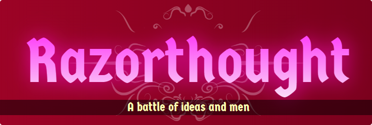

# Razorthought

    

---

    <a href="https://www.kesiev.com/razorthought/">Play the game on desktop</a>

---

**Razorthought** is an opensource single-player Card Battler game MIT licensed written in vanilla CSS/HTML/JavaScript I worked on in 2020 during the pandemic lockdown caused by COVID-19 virus. It has been heavily inspired by a stronghold of the genre, it's far for being perfect but I had fun working on it. I'll probably keep working on it a little more.

    

This period allowed me some time to think about how ideas and people, even if far in time and space, may meet and cooperate, fighting and influencing each other - whether they want it or not.

Well... it allowed me a lot of time for drawing, coloring, coding, and writing. This game collects most of the stuff I've built.

    

I've also worked with Arnaldo Brenna, a very good musician, entrepreneur, and worker that lives in the same building I live with small meetings on the balcony, and Bianca, my wife, who patiently and daily worked at the creative part with me.

I'm leaving this work here. I hope it will be useful for someone. And, why not, even entertaining.

‐ Francesco "KesieV" Cottone

_PS: The game is optimized for desktop only. I've used my mobile device a little during this lockdown!_

---

## Credits

### Code
KesieV

### Art
KesieV

### Art and creative support
Bianca Brenna

### Music
Arnaldo Brenna

### CC0 licensed sound effects
Kenney, https://opengameart.org/

---

## Nerdy details and TODO

Each card is a small JSON script that describes its appearance, conditions, and behavior when played. The game engine has an interpreter that executes these scripts during the match and tells the player what's allowed by the current _scripts on the table_ making stuff blinking.

The same goes for the AI: to keep it very simple and being able to freely add cards to the game without too much code fiddling, the AI is unaware of the logic of the cards but has a weighted set of goals to reach and can see the card effects in advance. Then it will choose the best sequence of actions to reach the best goal.

    

It's way from being perfect since it's more a tactic approach than a strategic approach to the game but the quality/effort balance resulted pretty good: your opponent won't let you win so easily and will make good use of card combos.

There is room for improvement there, like skipping same valued move evaluations or using less explainable AIs, like deep neural networks. But I decided to limit the whole project duration within the lockdown. Luckily it didn't allow me enough time for more improvements. :)